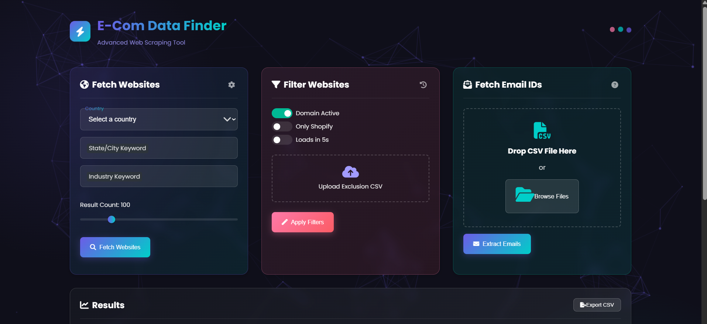

# E-Com Data Finder

Business data discovery app for finding e-commerce websites, filtering results, and extracting business emails from CSV uploads.



## What This Project Does

- Fetches website ideas by country, location keyword, and industry
- Filters websites by activity, Shopify usage, and load expectations
- Extracts email addresses from uploaded CSV data
- Exports the current results as CSV

## Project Structure

```text
.
|-- README.md
|-- LICENSE
|-- img.png
`-- nightout/
    |-- index.html
    |-- script.js
    |-- styles.css
    |-- server.js
    |-- package.json
    `-- assets/
```

## Local Setup

### Frontend only

1. Open `nightout/index.html` in a browser.
2. The app will ask for your Gemini API key the first time you run an AI action.
3. The key is stored only in your browser local storage, not in the repository.

### Node server

1. Go into the app folder:

   ```bash
   cd nightout
   ```

2. Install dependencies:

   ```bash
   npm install
   ```

3. Start the server:

   ```bash
   npm start
   ```

Note: `server.js` expects Redis when queue features are used.

## Before Pushing To GitHub

- Do not commit real API keys or `.env` files
- Keep `node_modules/` out of git
- Update the GitHub links in the UI/footer if you want them to point to your repository

## Push To GitHub

If your local repo is not connected yet:

```bash
git remote add origin https://github.com/<your-username>/<your-repo>.git
git add .
git commit -m "Prepare project for GitHub"
git push -u origin feature-branch
```

If you want to push to `main` instead:

```bash
git branch -M main
git push -u origin main
```

## License

MIT
